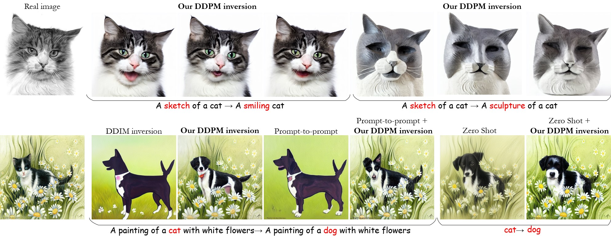

<!-- [](https://github.com/topics/single-image-generation) -->
[](https://www.python.org/downloads/release/python-38/)
[](https://pytorch.org/)


# DDPM_inversion

[Project](https://inbarhub.github.io/DDPM_inversion/) | [Arxiv](https://arxiv.org/abs/2304.06140) | [Supplementary materials](https://inbarhub.github.io/DDPM_inversion/resources/inversion_supp.pdf)
### Official pytorch implementation of the paper: <br>"An Edit Friendly DDPM Noise Space: Inversion and Manipulations"


Our inversion can be used for text-based editing of **real images**, either by itself or in combination with other editing methods.
Due to the stochastic manner of our method, we can generate diverse outputs, a feature that is not naturally available with methods relying on the DDIM inversion.

In this repository we support editing using our inversion, p2p+our inversion, ddim or p2p (with ddim inversion).

## Table of Contents
* [Requirements](#Requirements)
* [Repository Structure](#Repository-Structure)
* [Usage Examples](#Usage-Examples)
* [Data and Pretrained Models](#Data-and-Pretrained-Models)
* [Sources](#Sources)
* [Citation](#Citation)

## Requirements 

```
python -m pip install -r requirements.txt
```
This code was tested with python 3.8 and torch 1.13. 

## Repository Structure 
```
├── example_images - folder of input images to be edited
├── imgs - images used in this repository readme.md file
├── prompt_to_prompt - p2p code (contains our inversion)
├── main_run.py - main python file for running the method
└── test.yaml - yaml file contains images and prompt to run
```

A folder named 'results' will be automatically created and all the restuls will be saved to this folder, marked with a timestamp.

## Algorithm Inputs
The parameters of the method are: 
```
skip - controlling the adherence to the input image
cfg_tar - the strength of the classifier free guidance
```
Moreover, we should supply also an input image (```img_name```) and source and target prompts (```prompt_src``` and ```prompt_tar```). These three parameters can be given also in the test.yaml file.

All parameters have default values.

## Usage Examples 
```
python3 main_run.py --mode="XXX" --img_name="example_images/horse_mud.jpg" --prompt_src"a photo of a horse in the mud" --prompt_tar="a photo of a horse in the snow"
or 
python3 main_run.py --mode="XXX"
```
Where XXX can be ```our_inv```,```p2pinv``` (p2p+our imversion),```ddim``` or ```p2p``` (original p2p paper).

In ```our_inv``` and ```p2pinv``` We suggest to play with ```skip``` in the range [0,40] and ```cfg_tar``` in the range [7,18].

**For p2pinv and p2p**:
Pay attention that you can play with the corss-and self-attention via ```--xa``` and ```--sa``` arguments. We suggest to set them to (0.6,0.2) and (0.8,0.4) for p2pinv and p2p respectively.
**For ddim and p2p**:
```skip``` is set to be 0.

## Create Your Own Editing with Our Method
(1) Copy the input image to example_images folder.
(2) Add to the test.yaml the image with its source prompt and target prompts.
(3) Run ``main_run.py --mode="our_inv"``, play with ``skip`` and ``cfg_tar``.

## Sources 

The DDPM code was adapted from the following [pytorch implementation of DDPM](https://github.com/lucidrains/denoising-diffusion-pytorch). 

The modified CLIP model as well as most of the code in `./text2live_util/` directory was taken from the [official Text2live repository](https://github.com/omerbt/Text2LIVE). 
 


### Citation
If you use this code for your research, please cite our paper:

```
@article{HubermanSpiegelglas2023,
  title      = {An Edit Friendly DDPM Noise Space: Inversion and Manipulations},
  author     = {Huberman-Spiegelglas, Inbar and Kulikov, Vladimir and Michaeli, Tomer},
  journal    = {arXiv preprint arXiv:2304.06140},
  year       = {2023}
}
```